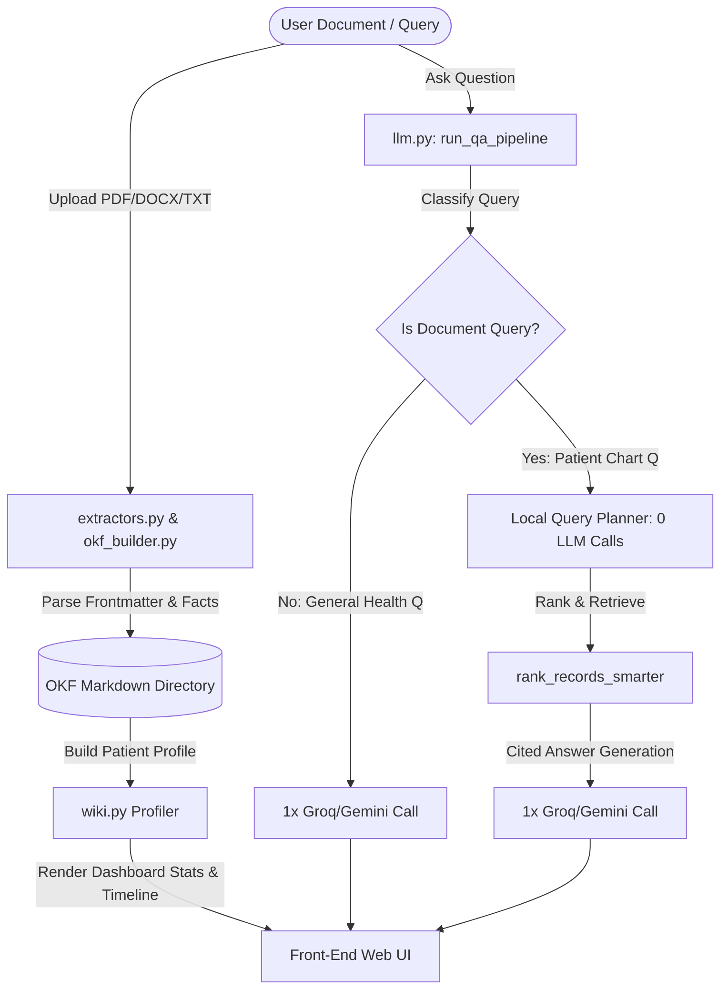

# 🏥 CareChronicle — Patient Record Intelligence

[](https://opensource.org/licenses/MIT)
[](https://fastapi.tiangolo.com/)
[](https://groq.com/)
[](https://modelcontextprotocol.io/)

CareChronicle is a clinical document workspace and information retrieval platform that structures unstructured clinical documents (PDF, DOCX, TXT, MD) into a flat-file database format called **Open Knowledge Format (OKF)**. It provides clinicians with a unified patient timeline, automated sidebar summarization, and a secure Q&A interface grounded strictly in patient documentation.

---

## ⚡ Core System Architecture



---

## 💡 System Design & Optimization

### 1. Open Knowledge Format (OKF)
CareChronicle stores patient health records as structured markdown documents containing rich YAML frontmatter. This format eliminates heavy database dependencies, keeping patient history fully human-readable, auditable, and version-controlled.
```yaml
---
id: lab-report-2026-07-01-diabetic-check-2026-07-01
type: lab-report
patient_id: patient-002
date: 2026-07-01
hospital: "Apex Diagnostics"
doctor: "Dr. Patel"
source_file: "diabetic-check-2026-07-01.txt"
links:
  - patient-002
  - glucose-fasting
  - hba1c
---
# Lab Report
## Extracted factual details
- Glucose (Fasting): 140 mg/dL
- HbA1c: 7.4 %
```

### 2. Model Context Protocol (MCP) Integration
CareChronicle runs a parallel Model Context Protocol (MCP) server. Any agentic LLM (like Claude Desktop) can connect directly to CareChronicle using the following exposed tools:
- `convert_text_to_okf` — Convert raw medical text input into structured OKF format.
- `ingest_document_file` — Ingest local files automatically.
- `get_patient_wiki_profile` — Compile current patient conditions, tests, and medications.
- `list_patient_records` — List all stored OKF records for a specific patient.
- `search_okf_records` — Query planner search tool.
- `query_patient_records` — Run full safety-first answering tool over records.

### 3. LLM Cost Optimization & Routing
Standard clinical Retrieval-Augmented Generation (RAG) platforms make multiple LLM calls to check safety, generate query keywords, determine matching record types, and formulate answers. CareChronicle optimizes this cost flow to a **maximum of 1 LLM call** per user turn:

* **Local Keyword Classifier** (`is_document_query`): Determines if the question is a general health question or requires patient records.
* **General Health Questions**: Bypasses the query planner and safety filter LLM calls completely. Uses **exactly 1 LLM call** to produce a patient-friendly summary.
* **Document-Related Questions**:
  - Uses a **0-cost local parser** (`fallback_plan`) to parse keywords and map targeted clinical document types (Prescriptions, Lab Reports, Discharge Summaries).
  - Performs keyword matching and TF-IDF-inspired ranking locally.
  - Sends the compiled, top-matching OKF documents into **exactly 1 LLM call** to synthesize a cited answer.
* **Cost Savings**: Reductions of up to **75% in token consumption** and **80% in latency** compared to standard multi-agent RAG implementations.

---

## 🛠️ Installation & Local Setup

### 1. Prerequisites
- Python 3.10 or higher installed.
- Active Groq API Key (Primary) and/or Google Gemini API Key (Fallback).

### 2. Install Project Dependencies
Clone the repository, create a virtual environment, and install requirements:
```bash
git clone https://github.com/Ankithraj-1312/carechronicle.git
cd carechronicle

# Create virtual environment
python -m venv venv

# Activate virtual environment
# On Windows (PowerShell):
venv\Scripts\Activate.ps1
# On Linux/MacOS:
source venv/bin/activate

# Install required packages
pip install -r requirements.txt
```

### 3. Environment Configuration
Create a file named `.env` in the root directory:
```env
PORT=3005
Groq_API_KEY=your_groq_api_key_here
GEMINI_API_KEY=your_gemini_api_key_here
```

### 4. Running the Platform
Start the FastAPI server:
```bash
python main.py
```
The server will bind and run on **`http://localhost:3005`**.

---

## 🧪 Local Testing & Evaluation Guide

Follow these steps to test all core features of CareChronicle on your local machine:

### Scenario 1: General Clinical Queries
1. Select any patient from the dropdown list.
2. In the query box, ask: `"What is Type-2 diabetes and how is it managed?"`
3. Click **Ask Engine**.
4. **Expected Behavior**: The system uses the local classifier to route this as a general question. It bypasses search queries and directly outputs a comprehensive medical explanation with zero document references.

### Scenario 2: Patient Record Queries
1. Select **Ravi Mehta (patient-002)**.
2. Ask: `"What is my Metformin dose and who prescribed it?"`
3. Click **Ask Engine**.
4. **Expected Behavior**: The local query planner matches the `prescription` type and retrieves Ravi's prescription OKF files. The output will explicitly cite `[prescription-2026-07-02-...]`, detailing:
   - Metformin 500 mg, 1 tablet twice daily with meals.
   - Prescribed by **Dr. Patel** on **2026-07-02**.

### Scenario 3: Document Ingestion
1. Select **Emily Chen (patient-003)** (currently has no records).
2. Prepare a raw text file or document containing sample medical text.
3. Drag and drop the file into the **Document Ingestion** area, or click **Browse** to select it.
4. Watch the progress steps animate:
   - *Extracting document text...*
   - *Building OKF Markdown structure...*
   - *Re-indexing Patient Timeline...*
5. **Expected Behavior**: The sidebar dashboard (active conditions, medications, tests) and visual timeline will immediately update with the newly parsed data.

### Scenario 4: Offline Mode (3-Tier Fallback Validation)
1. Stop the server (`Ctrl + C`).
2. Temporarily open your `.env` file and clear the API keys (`Groq_API_KEY=` and `GEMINI_API_KEY=`).
3. Start the server again (`python main.py`).
4. Ask a patient question like: `"What are my active medications?"`
5. **Expected Behavior**: The system triggers Tier 3 (offline mode) and utilizes a deterministic regular expression parser to locate medication records, displaying cited factual timeline cards without throwing errors.

---

## 🔮 Future Improvements & Roadmap

- [ ] **EHR Integrations**: Map OKF output schema to FHIR (Fast Healthcare Interoperability Resources) JSON endpoints for legacy EHR syncing.
- [ ] **Vector Search Support**: Add an optional lightweight local vector database (like ChromaDB or Faiss) to supplement keyword search for highly abstract queries.
- [ ] **OCR Engine Upgrades**: Integrate local Tesseract OCR or docTR to process low-quality handwriting on scanned paper prescriptions.
- [ ] **Automated Key-Leak Guards**: Implement pre-commit hooks to guarantee private keys and `.env` settings are never pushed to public repositories.
- [ ] **Multi-page PDF Chunking**: Improve the `extract_text` script to track page numbers and structure multi-page documents into distinct sub-records.

---

## 📂 Directory Layout

```
├── data/
│   └── okf/
│       └── patients/        # Human-readable OKF patient records
├── lib/
│   ├── extractors.py        # PDF/DOCX/TXT text parsers
│   ├── llm.py               # Classification, routing, Q&A prompts, API fallbacks
│   ├── okf_builder.py       # Converts raw documents into OKF schemas
│   └── wiki.py              # Compiles sidebar stats and patient profiles
├── public/
│   ├── app.js               # Frontend UI interactions and typewriter effect
│   ├── index.html           # Main dashboard template
│   └── styles.css           # Glassmorphic dark styling
├── main.py                  # API endpoints and server setup
├── mcp_server.py            # FastMCP tools definitions
├── requirements.txt         # Project dependencies
└── README.md                # Documentation
```

---

## 📝 License
This project is licensed under the MIT License - see the [LICENSE](LICENSE) file for details.
