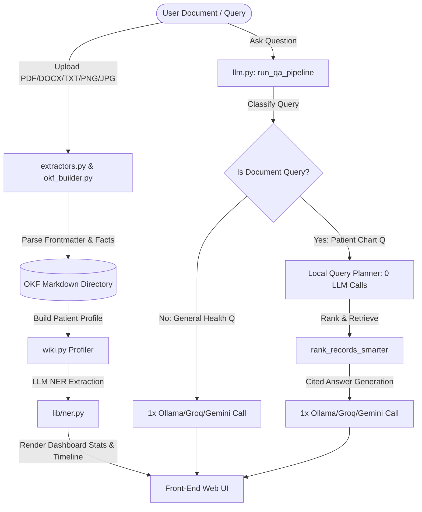

# 🏥 CareChronicle — Patient Record Intelligence

[](https://opensource.org/licenses/MIT)
[](https://fastapi.tiangolo.com/)
[](https://groq.com/)
[](https://ollama.com/)
[](https://hl7.org/fhir/)

CareChronicle is a clinical document workspace and information retrieval platform that structures unstructured clinical documents (PDF, DOCX, TXT, MD, PNG, JPG) into a flat-file database format called **Open Knowledge Format (OKF)**. It provides clinicians with a unified patient timeline, automated sidebar summarization, and a secure Q&A interface grounded strictly in patient documentation.

---

## ⚡ Core System Architecture



---

## 🚀 Hospital-Grade & EHR Readiness Upgrades

We have implemented five critical features to prepare CareChronicle for production-grade clinical environments:

### 1. 🔒 Data Privacy: Ollama Local LLM Support (HIPAA-Safe)
To protect Patient Health Information (PHI) under strict compliance guidelines (e.g. HIPAA), CareChronicle can run entirely offline without calling public cloud APIs.
* **How it works**: By configuring `OLLAMA_HOST` in `.env`, the Q&A engine, general question classifier, and clinical entity extractor route all requests to your local secure Ollama instance.
* **Recommended Models**: Use `biomistral` (clinical fine-tune) or `llama3` / `llama3.1` (general).

### 2. 📄 Scanned OCR: 4-Tier Intelligent OCR Fallback
Real hospital prescriptions are often handwritten, printed scans, or image files. CareChronicle handles this gracefully via an automated 4-tier fallback pipeline:
1. **Local Tesseract OCR**: First tries running fast, local Tesseract OCR to process files without any external network request.
2. **Local Ollama Vision LLM** (HIPAA-safe): If Tesseract is not installed or returns empty text, it calls your local running Ollama instance using a vision model (e.g. `moondream` or `llava`).
3. **Google Gemini Vision Fallback**: Routes to Google's Gemini cloud vision engine (`gemini-3.5-flash`) via the Generative AI SDK using your `GEMINI_API_KEY`.
4. **Groq Vision Cloud Fallback**: If local LLM/Ollama and Gemini fallback are offline, it securely routes to Groq's high-speed cloud vision engine using models like `llava-v1.5-7b-4096-preview` or `llama-4-scout-17b-16e-instruct`.

### 3. 🧠 Clinical NER: LLM-Based Entity Extraction
Replaces brittle keyword regular expression searches with an advanced LLM Clinical Named Entity Recognition (NER) prompt.
* **How it works**: When loading patient dashboards, the engine invokes a fast clinical NER pipeline to identify diagnoses, drug schedules, dosage frequencies, lab values, reference ranges, and abnormal flags, falling back to regex rules if offline.

### 4. 🏥 EHR Integration: FHIR R4 Patient Import
Sync CareChronicle directly with medical records in hospital EHR networks like Epic, Cerner, or Athena.
* **How it works**: A dedicated modal interface lets clinicians point to a standard HL7 FHIR endpoint, specify a patient ID, and sync `Observation` (lab results) and `MedicationRequest` resources into OKF Markdown files in one click.

### 5. 🔌 Model Context Protocol (MCP) Integration
CareChronicle runs a parallel Model Context Protocol (MCP) server. Any agentic LLM (like Claude Desktop) can connect directly to CareChronicle using the following exposed tools:
* `convert_text_to_okf` — Convert raw medical text input into structured OKF format.
* `ingest_document_file` — Ingest local files automatically.
* `get_patient_wiki_profile` — Compile current patient conditions, tests, and medications.
* `list_patient_records` — List all stored OKF records for a specific patient.
* `search_okf_records` — Query planner search tool.
* `query_patient_records` — Run full safety-first answering tool over records.

---

## 💡 System Design & Cost Optimization

### 1. Open Knowledge Format (OKF)
CareChronicle stores patient health records as structured markdown documents containing rich YAML frontmatter. This format eliminates heavy database dependencies, keeping patient history fully human-readable, auditable, and version-controlled.
```yaml
---
id: lab-report-2026-07-01-diabetic-check-2026-07-01
type: lab-report
patient_id: patient-002
date: 2026-07-01
hospital: "Apex Diagnostics"
doctor: "Dr. Patel"
source_file: "diabetic-check-2026-07-01.txt"
links:
  - patient-002
  - glucose-fasting
  - hba1c
---
# Lab Report
## Extracted factual details
- Glucose (Fasting): 140 mg/dL
- HbA1c: 7.4 %
```

### 2. LLM Cost Optimization & Routing
Standard clinical Retrieval-Augmented Generation (RAG) platforms make multiple LLM calls to check safety, generate query keywords, determine matching record types, and formulate answers. CareChronicle optimizes this cost flow to a **maximum of 1 LLM call** per user turn:

* **Local Keyword Classifier** (`is_document_query`): Determines if the question is a general health question or requires patient records.
* **General Health Questions**: Bypasses the query planner and safety filter LLM calls completely. Uses **exactly 1 LLM call** to produce a patient-friendly summary.
* **Document-Related Questions**:
  - Uses a **0-cost local parser** (`fallback_plan`) to parse keywords and map targeted clinical document types (Prescriptions, Lab Reports, Discharge Summaries).
  - Performs keyword matching and TF-IDF-inspired ranking locally.
  - Sends the compiled, top-matching OKF documents into **exactly 1 LLM call** to synthesize a cited answer.
* **Cost Savings**: Reductions of up to **75% in token consumption** and **80% in latency** compared to standard multi-agent RAG implementations.

---

## 🛠️ Installation & Local Setup

### 1. Prerequisites
- Python 3.10 or higher installed.
- Active Groq API Key (Primary & OCR Fallback).
- Active Gemini API Key (Secondary Fallback).
- [Ollama](https://ollama.com/) running locally for HIPAA mode and local OCR.
- (Optional) [Tesseract OCR](https://github.com/tesseract-ocr/tesseract) installed on your system PATH for local OCR ingestion.

### 2. Install Project Dependencies
Clone the repository, create a virtual environment, and install requirements:
```bash
git clone https://github.com/Ankithraj-1312/carechronicle.git
cd carechronicle

# Create virtual environment
python -m venv venv

# Activate virtual environment
# On Windows (PowerShell):
venv\Scripts\Activate.ps1
# On Linux/MacOS:
source venv/bin/activate

# Install required packages
pip install -r requirements.txt
```

### 3. Environment Configuration
Create a file named `.env` in the root directory:
```env
PORT=3005
Groq_API_KEY=your_groq_api_key_here
GEMINI_API_KEY=your_gemini_api_key_here

# Local HIPAA / Offline Configuration (Optional)
# OLLAMA_HOST=http://localhost:11434
# OLLAMA_MODEL=moondream
```

### 4. Running the Platform
Start the FastAPI server:
```bash
python main.py
```
The server will bind and run on **`http://localhost:3005`**.

---

## 🎬 Live Demo & Step-by-Step Walkthrough

Follow these steps to run a full demonstration of CareChronicle's clinical capabilities:

### Scenario 1: FHIR EHR Record Sync
1. Click **+** in the left sidebar and register a new patient named `"EHR Import Demo"`.
2. Click **Import from FHIR EHR** at the bottom of the Document Ingestion card.
3. Keep the default open public sandbox server URL (`https://hapi.fhir.org/baseR4`).
4. Type test patient ID: **`example`** (or **`1185012`**) and click **Start FHIR Sync**.
5. **Result**: CareChronicle fetches observation/prescription history from the public server, builds OKF Markdown files, and dynamically updates the patient profile and timeline in the UI.

### Scenario 2: Prescription Image OCR Ingestion
1. Select any active patient.
2. Drag and drop `prescription_demo.png` (provided in the repository root) into the ingestion dropzone.
3. **Result**: The system converts the PNG image, runs OCR text extraction, and processes it through the Clinical NER model to index medications (Atorvastatin, Aspirin) automatically.

### Scenario 3: Custom Patient Ingestion (Priya Nair Case Study)
Test the document converter using these sample raw clinical files.

1. Click **+** in the left sidebar and register a new patient named **`Priya Nair`**.
2. Select **Priya Nair** in the sidebar.
3. Under the **Document Ingestion** card on the right, paste the text from **Discharge Summary** (below) into the text input, set the filename as `discharge_summary.txt`, and click **Convert & Save**.
4. Repeat the ingestion step for the **Lab Report** and **Outpatient Prescription** files.
5. Go to the **Q&A Panel** at the bottom and ask:
   * `"What are Priya Nair's active blood pressure medications?"`
   * `"What was Priya's ferritin level on July 14?"`
6. **Result**: You will get precise answers with clickable citations referencing the specific OKF documents.

---

### 📂 Priya Nair Demo Files

<details>
<summary>📄 1. Discharge Summary (discharge_summary.txt)</summary>

```text
METRO HEART & GENERAL HOSPITAL
DEPARTMENT OF GENERAL MEDICINE
12, Rajiv Gandhi Nagar, Bangalore - 560 001

====================================================
          INPATIENT DISCHARGE SUMMARY
====================================================

ADMISSION DETAILS
-----------------
Patient Name       : Priya Nair
Patient ID         : PAT-2026-004
Age / Gender       : 38 Years / Female
Date of Admission  : 10-July-2026
Date of Discharge  : 13-July-2026
Ward               : General Medicine - Ward B, Bed 14
IP Number          : MHH-IP-2026-00714
Consultant         : Dr. Meera Krishnan, MD (General Medicine)

====================================================
REASON FOR ADMISSION
====================================================
Patient presented to the Emergency Department on 10-July-2026 with
complaints of:
  - Severe fatigue and generalised weakness for 3 weeks
  - Persistent headache (frontal, non-throbbing) for 10 days
  - Palpitations on mild exertion for 5 days
  - Breathlessness on climbing stairs (Grade II dyspnoea)
  - Occasional dizziness on standing
  - Pallor noted by family members over 1 month

No chest pain, no syncope, no pedal oedema reported.

====================================================
SIGNIFICANT HISTORY
====================================================
Past Medical History   : Nil significant
Surgical History       : Appendectomy (2019, Manipal Hospital)
Family History         : Father - Hypertension, Diabetes
Menstrual History      : Heavy menstrual cycles (Menorrhagia) since 6 months
Allergies              : NKDA (No Known Drug Allergies)
Occupation             : Software Engineer
Lifestyle              : Predominantly sedentary, low dietary iron intake

====================================================
CLINICAL FINDINGS ON ADMISSION
====================================================
General Condition  : Conscious, oriented, mild pallor, no icterus
Pulse              : 96 bpm, regular
Blood Pressure     : 150 / 96 mmHg
Respiratory Rate   : 18 breaths/min
SpO2               : 98% on room air
Temperature        : 98.4 F (Afebrile)
Pallor             : Present (conjunctival and palmar)
Koilonychia        : Present (bilateral)
Cardiovascular     : S1 S2 heard, soft systolic murmur at apex (grade 2/6)
Respiratory        : Clear air entry bilaterally
Abdomen            : Soft, non-tender, no organomegaly

====================================================
INVESTIGATIONS DURING ADMISSION
====================================================
CBC (10-July-2026):
  Haemoglobin: 9.6 g/dL (LOW)         WBC: 8,100 /uL (Normal)
  RBC: 3.7 million/uL                 Platelets: 198,000 /uL (Normal)
  PCV: 31.4% (LOW)                    MCV: 78 fL (Microcytic)

Serum Ferritin: 5 ng/mL (Severely LOW - Normal: 12-150 ng/mL)
Serum Iron: 44 ug/dL (LOW)
TIBC: 410 ug/dL (HIGH)

Peripheral Blood Smear: Microcytic hypochromic red cells, pencil cells noted.
  Consistent with Iron Deficiency Anaemia.

ECG (12-Lead): Sinus tachycardia. No ST-T changes. No LVH pattern.

Renal Function Test: Serum Creatinine 0.8 mg/dL (Normal)
                     Serum Potassium 4.1 mEq/L (Normal)
Thyroid Function     TSH 2.4 mIU/L (Normal)
Gynaecology Consult  : Confirmed Menorrhagia. Tranexamic Acid initiated.
                       Pelvic ultrasound: No fibroids, no polyps.
                       Advised haematology correlation.

====================================================
DIAGNOSIS (FINAL)
====================================================
PRIMARY   : Iron Deficiency Anaemia (IDA) secondary to Menorrhagia
SECONDARY : Stage 1 Hypertension (newly detected)

====================================================
TREATMENT GIVEN DURING STAY
====================================================
1. IV Iron Sucrose 200 mg in 100 mL Normal Saline over 30 min
   - Administered on Days 1, 2, and 3 of admission (10, 11, 12 July 2026)
   - Total parenteral iron given: 600 mg
   - Tolerated well, no adverse reactions

2. Tab Amlodipine 5 mg once daily (initiated Day 2 for hypertension)

3. Tab Tranexamic Acid 500 mg thrice daily for menorrhagia control

4. Dietary iron supplementation advised by hospital dietitian

====================================================
CONDITION AT DISCHARGE
====================================================
Patient clinically improved. Haemoglobin at discharge: 10.2 g/dL (rising).
BP stabilised at 136/88 mmHg on Amlodipine.
Palpitations resolved. Fatigue significantly reduced.
Discharged in stable condition.

====================================================
DISCHARGE INSTRUCTIONS
====================================================
1. Continue Ferrous Sulphate 150 mg twice daily for 3 months.
2. Continue Vitamin C 500 mg twice daily with iron tablet.
3. Continue Amlodipine 5 mg once daily in the morning.
4. Continue Losartan 50 mg once daily in the evening.
5. Avoid tea/coffee within 1 hour of iron tablet.
6. Eat iron-rich foods: spinach, lentils, rajma, lean meat, jaggery.
7. Return to ER immediately if: chest pain, severe headache, BP > 180/110.
8. Follow up with Dr. Meera Krishnan on 20-August-2026 with repeat CBC
   and iron studies.
9. Gynaecology follow-up: 25-July-2026 (Appointment confirmed).

====================================================
ATTENDING PHYSICIAN
====================================================
Dr. Meera Krishnan, MD (General Medicine)
Registration No: KMC-45821
Metro Heart & General Hospital, Bangalore

====================================================
    ** DISCHARGE SUMMARY GENERATED ON 13-JULY-2026 **
          Authorised Signatory & Hospital Seal
====================================================
```

</details>

<details>
<summary>📄 2. Lab Report (lab_report.txt)</summary>

```text
METRO HEART & GENERAL HOSPITAL
DEPARTMENT OF PATHOLOGY & LABORATORY MEDICINE
12, Rajiv Gandhi Nagar, Bangalore - 560 001
Ph: +91-80-4123-7890 | Lab License No: KAR/LAB/2019/00872

====================================================
        COMPREHENSIVE BLOOD INVESTIGATION REPORT
====================================================

Patient Name   : Priya Nair
Patient ID     : PAT-2026-004
Age / Gender   : 38 Years / Female
Referred By    : Dr. Meera Krishnan, MD (General Medicine)
Sample Type    : Venous Blood (EDTA)
Sample ID      : MHH-BL-20260714-0041
Collection Date: 14-July-2026   Time: 08:35 AM
Report Date    : 14-July-2026   Time: 01:15 PM

----------------------------------------------------
 COMPLETE BLOOD COUNT (CBC)
----------------------------------------------------
Test                        Result     Unit       Reference Range   Flag
Haemoglobin (Hb)           10.8       g/dL       12.0 - 15.5       LOW
Red Blood Cells (RBC)       3.9        million/uL  3.8 - 5.2
Packed Cell Volume (PCV)    34.2       %          36.0 - 46.0       LOW
Mean Corpuscular Volume     82.5       fL         80.0 - 100.0
MCH                         27.7       pg         27.0 - 33.0
MCHC                        31.6       g/dL       31.5 - 35.0
White Blood Cells (WBC)     8,400      /uL        4,000 - 11,000
Neutrophils                 62         %          40 - 70
Lymphocytes                 28         %          20 - 40
Monocytes                    6         %          2 - 10
Eosinophils                  3         %          1 - 6
Basophils                    1         %          0 - 1
Platelet Count             210,000    /uL        1,50,000 - 4,00,000

----------------------------------------------------
 SERUM IRON STUDIES
----------------------------------------------------
Serum Iron                  52         ug/dL      60 - 170          LOW
Total Iron Binding Capacity 390        ug/dL      250 - 370         HIGH
Transferrin Saturation      13.3       %          20 - 50           LOW
Serum Ferritin              8          ng/mL      12 - 150          LOW

----------------------------------------------------
 BLOOD PRESSURE (Recorded at Clinic)
----------------------------------------------------
Reading 1 (08:40 AM):   148 / 94 mmHg
Reading 2 (08:55 AM):   145 / 92 mmHg
Average:                146 / 93 mmHg          [ELEVATED - Stage 1 Hypertension]

----------------------------------------------------
 INTERPRETATION (Pathologist's Note)
----------------------------------------------------
Findings are consistent with Iron Deficiency Anaemia. Low serum ferritin (8 ng/mL)
and low transferrin saturation (13.3%) strongly support iron store depletion.
Blood pressure readings indicate Stage 1 Hypertension. Clinical correlation advised.

Reported by: Dr. Sunita Rao, MD Pathology
Verified by:  Metro Heart & General Hospital, Bangalore
====================================================
      ** THIS IS A COMPUTER-GENERATED REPORT **
      Report valid only with authorized signatory.
====================================================
```

</details>

<details>
<summary>📄 3. Outpatient Prescription (prescription.txt)</summary>

```text
METRO HEART & GENERAL HOSPITAL
OUTPATIENT PRESCRIPTION
OPD Receipt No: MHH-OPD-2026-07-16-00318
Date: 16-July-2026

====================================================
PHYSICIAN DETAILS
====================================================
Name     : Dr. Meera Krishnan
Degree   : MD (General Medicine), MBBS
Reg. No  : KMC-45821
Facility : Metro Heart & General Hospital, Bangalore

====================================================
PATIENT DETAILS
====================================================
Name        : Priya Nair
Patient ID  : PAT-2026-004
Age / Gender: 38 Years / Female
Weight      : 58 kg
Diagnosis   : Iron Deficiency Anaemia | Stage 1 Hypertension

====================================================
Rx  (PRESCRIPTION)
====================================================

1. Ferrous Sulphate 150 mg
   - Take 1 tablet TWICE daily (morning and evening)
   - To be taken on EMPTY STOMACH with a glass of water
   - Avoid taking with tea, coffee, or dairy products
   - Duration: 90 days

2. Ascorbic Acid (Vitamin C) 500 mg
   - Take 1 tablet TWICE daily along with Ferrous Sulphate
   - Helps improve iron absorption
   - Duration: 90 days

3. Amlodipine 5 mg
   - Take 1 tablet ONCE daily in the MORNING
   - For blood pressure control
   - Do NOT stop without consulting physician
   - Duration: Ongoing (review at next visit)

4. Losartan 50 mg
   - Take 1 tablet ONCE daily in the EVENING
   - For blood pressure control, combined with Amlodipine
   - Monitor for dizziness especially when standing up
   - Duration: Ongoing (review at next visit)

====================================================
CLINICAL NOTES
====================================================
- Repeat CBC and Iron Studies after 8 weeks of iron therapy.
- Monitor BP at home; target BP < 130/80 mmHg.
- Dietary counselling: increase intake of green leafy vegetables,
  lentils, and lean red meat. Avoid high-sodium processed foods.
- Avoid NSAIDs (e.g. Ibuprofen) which may elevate BP.

====================================================
FOLLOW-UP
====================================================
Next Appointment: 20-August-2026
Department: General Medicine OPD
Time: 10:00 AM (Please carry this prescription and lab reports)

Dr. Meera Krishnan
Metro Heart & General Hospital
Bangalore - 560 001
Signature & Stamp
====================================================
```

</details>

---

## 📂 Directory Layout

```
├── data/
│   ├── okf/
│   │   └── patients/        # Human-readable OKF patient records
│   └── patients.json        # Persistent patient profiles registry
├── lib/
│   ├── extractors.py        # PDF/DOCX/TXT/Image Tesseract text OCR parsers
│   ├── fhir_client.py       # Client for connecting to FHIR HL7 EHR servers
│   ├── llm.py               # Classification, routing, Q&A prompts, API fallbacks
│   ├── ner.py               # LLM clinical entity extraction (NER) helper
│   ├── okf_builder.py       # Converts raw documents into OKF schemas
│   └── wiki.py              # Compiles sidebar stats and patient profiles
├── public/
│   ├── app.js               # Frontend UI interactions and typewriter effect
│   ├── index.html           # Main dashboard template
│   └── styles.css           # Glassmorphic dark styling
├── main.py                  # API endpoints and server setup
├── mcp_server.py            # FastMCP tools definitions
├── requirements.txt         # Project dependencies
└── README.md                # Documentation
```

---

## 📝 License
This project is licensed under the MIT License - see the [LICENSE](LICENSE) file for details.
